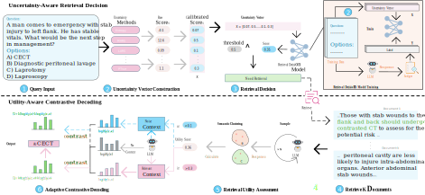

# D²-RAG: Dual-Decision Retrieval-Augmented Generation via Multi-Dimensional Uncertainty and Utility-Aware Decoding

This includes the original implementation of D²-RAG: Dual-Decision Retrieval-Augmented Generation via Multi-Dimensional Uncertainty and Utility-Aware Decoding.

**D²-RAG** is a framework that achieves adaptive knowledge retrieval and utilization through a dual-stage decision mechanism.

## 📌 Abstract

Retrieval-Augmented Generation (RAG) mitigates hallucinations in large language models by incorporating external knowledge. However, retrieval does not always return relevant documents and may return noisy ones. Indiscriminately retrieving and utilizing this external knowledge can interfere with the model's originally correct reasoning. In this work, we propose Dual-Decision Retrieval-Augmented Generation (D²-RAG), which integrates multi-dimensional uncertainty estimation to decide whether to retrieve and employs adaptive contrastive decoding to handle retrieved contexts of varying quality. Specifically, we first integrate uncertainty estimation scores that assess model uncertainty from multiple perspectives, construct them into a comprehensive feature vector, and train a lightweight retrieval decision model to accurately identify the model's knowledge boundaries and determine whether to retrieve. Subsequently, we dynamically adjust the contrastive decoding strategy based on the utility of retrieved contexts to enhance the utilization of relevant contexts while suppressing interference from noisy contexts. Extensive experiments on four medical question-answering datasets demonstrate that D²-RAG significantly outperforms baselines, enabling retrieval-augmented Llama3.1-8B to surpass non-retrieval-augmented Llama3.1-70B on the MedMCQA dataset.

## 🖼️ Framework



## 📋 Content
1. [⚙️ Installation](#installation)
2. [🚀 Quick Start](#quick-start)
3. [📊 Baselines](#baselines)


## ⚙️ Installation
You can create a conda environment by running the command below.
```
conda env create -f environment.yml
```
## 🚀 Quick start
We provide [example data](example data.jsonl). You can get our final results by by running the command below.

```
python example.py
```
📝 Your input file should be a `jsonl`.

[example.ipynb](example.ipynb) contains the complete implementation of our pipeline.

we use Qwen3-Embedding-4B as our embedding model. 

📚Medical textbook data coming soon.

[get_context_for_each_query_V2.py](get_context_for_each_query_V2.py) — Retrieves relevant documents for each query, powered by [LlamaIndex](https://www.llamaindex.ai/).

```
python get_context_for_each_query_V2.py
```
## 📊 Baselines

Implementation code for a subset of baseline methods.

[RAG.ipynb](RAG.ipynb) — Retrieval-Augmented Generation baseline.

[cad.ipynb](cad.ipynb) — Context-Aware Decoding (CAD) baseline.

[dola.ipynb](dola.ipynb) — Decoding by Contrasting Layers (DoLa) baseline.


